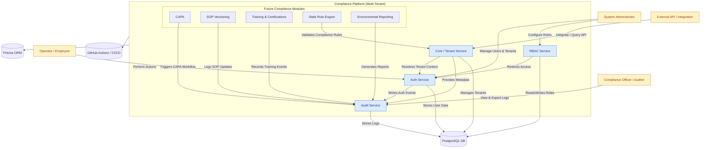

# 🧭 01 — Context Diagram

**Author:** Matthew Graba  
**Last Updated:** 2025-10-08  
**Location:** `/docs/architecture/01-context-diagram.md`

---

## 🎯 Purpose

This diagram illustrates all **primary actors**, **internal systems**, and **cross-cutting compliance controls** that define the Compliance Platform’s high-level architecture.  
It serves as the first layer of understanding — showing *who interacts with the platform*, *what core modules exist*, and *how compliance data flows* across domains.

---

## 🧩 Key Concepts

| Element | Description |
|----------|--------------|
| **Actors** | External entities (Users, Auditors, APIs) that interact with the platform. |
| **Subsystems** | Internal services (Auth, Core, Audit, RBAC, etc.) managing specific compliance functions. |
| **Compliance Controls** | Cross-cutting layers enforcing consistency, security, and traceability. |
| **External Integrations** | Future connectors (state compliance engines, reporting systems, training APIs). |

---

## 🌐 Context Overview

The **Compliance Platform** acts as a secure, multi-tenant backend that centralizes authentication, access control, and auditability for regulated organizations.  
It’s designed to expand modularly over time, integrating additional compliance layers (CAPA, SOPs, Training, Environmental Reporting) on top of a shared data and control foundation.

---

## 🧱 Core Modules

| Subsystem | Role | Current Status |
|------------|------|----------------|
| **Auth Service** | Manages user registration, login, and JWT issuance. | 🚧 Active (Sprint 1) |
| **Audit Service** | Logs all user/system actions for regulatory traceability. | 🔜 Planned (Sprint 2–3) |
| **RBAC Service** | Enforces role-based permissions across all actions. | 📝 Proposed |
| **Core / Tenant Service** | Manages organization-level metadata and schema mapping. | 🧩 Active |
| **Compliance Modules (Future)** | CAPA, SOPs, Training/Certifications, State Rule Engine, Environmental Reporting. | 🧱 Deferred |

---

## 🧩 Cross-Cutting Compliance Controls

| Control | Description |
|----------|--------------|
| **RBAC** | Ensures actions are only performed by authorized users according to defined roles. |
| **Audit Logs** | Tracks all data mutations, user actions, and system events. |
| **CAPA** | Corrective and Preventive Actions — future subsystem for nonconformance management. |
| **SOP Versioning** | Tracks controlled documents and procedural updates. |
| **Training & Certifications** | Associates users with required competency validation. |
| **State Rule Engine** | Syncs and validates against evolving regional regulatory requirements. |
| **Environmental Reporting** | Automates ESG and compliance impact tracking. |

---

## 📊 Mermaid Diagram

Below is the rendered **system context diagram**, depicting all key actors, services, and future integrations.

---

## 🧭 Diagram Notes

- **🟦 Blue Nodes** — Core backend services that currently exist or are under active development (`Auth`, `Audit`, `RBAC`, `Core / Tenant`).  
- **🟩 Green Nodes** — Planned or deferred compliance modules (`CAPA`, `SOP Versioning`, `Training`, `State Rule Engine`, `Environmental Reporting`).  
- **🟨 Yellow Nodes** — External actors or integrations (Administrators, Auditors, Operators, APIs).  
- Every request and database transaction is **tenant-aware**, scoped through the `core.tenants` schema.  
- The **Audit Service** acts as a *central observer*, logging all meaningful user and system events.  
- All database operations flow through **Prisma ORM**, ensuring consistent schema migrations, validation, and transactional safety.  
- **RBAC** enforces least-privilege access at both the middleware and database levels.  
- **Auth** and **Audit** subsystems form the platform’s trust foundation — no module may bypass them.  
- The **DevOps layer** (Docker + GitHub Actions) guarantees reproducible environments, automated lint/test/build pipelines, and stable CI/CD deployment.  
- Cross-cutting controls like **Audit Logging**, **RBAC**, and **Tenant Isolation** serve as the compliance backbone for all current and future modules.  
- Data does **not** flow directly between domain modules — all communication is validated through service boundaries and logged via the audit layer.  
- Each subsystem is independently deployable and documented via its own ADRs, maintaining architectural transparency and traceability.  

---

## ✅ Next Steps

1. **Integrate CI/CD nodes** into the diagram once ADR-0003 (Docker Integration) is implemented.  
2. **Expand RBAC flow** once ADR-0004 is accepted — include role and permission mapping visuals.  
3. **Add dashboard/frontend nodes** after initial web UI integration (Next.js + Auth API).  
4. **Visualize CAPA and SOP Versioning** once those modules have schema definitions (ADR-0011, future).  
5. **Review diagram quarterly** — update module status and color coding to reflect current sprint progress.  

---

> “Architecture clarity comes from showing who talks to whom — and who must never talk at all.”  
> — *Compliance Platform Engineering Handbook*
