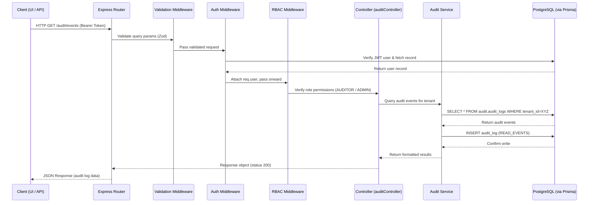

# 🔄 02 — End-to-End Request Flow

**Author:** Matthew Graba  
**Last Updated:** 2025-10-08  
**Location:** `/docs/architecture/02-ete-flow.md`

---

## 🎯 Purpose
This document outlines the **end-to-end request lifecycle** within the Compliance Platform — tracing how data travels through each subsystem, from the user or API client to the database and back.  

It demonstrates:
- Authentication and authorization flow  
- Middleware sequencing  
- Audit event generation  
- Prisma and PostgreSQL integration  
- Tenant-aware request resolution  

---

## 🧠 High-Level Summary
Every request in the Compliance Platform follows a consistent pipeline designed for **security, traceability, and modularity**:

1. **Entry:** Incoming HTTP request (frontend or API client).  
2. **Validation:** Request schema validated using Zod.  
3. **Authentication:** JWT decoded, tenant resolved, and `req.user` attached.  
4. **Authorization:** User roles validated against RBAC rules.  
5. **Controller Logic:** Request dispatched to appropriate service.  
6. **Audit Hook:** Action logged in `audit.audit_logs`.  
7. **Database Transaction:** Prisma executes schema-bound query.  
8. **Response:** Data serialized and returned to client.  

Each step may vary slightly per route, but this sequence represents the backbone of the system.

---

## 🧩 Request Flow Narrative (Example: Authenticated `/audit/events`)

| Step | Component | Description |
|------|------------|-------------|
| **1** | **API Gateway (Express Router)** | Receives a GET `/audit/events` request with Bearer JWT header. |
| **2** | **Validation Middleware** | Confirms presence of valid token and required query params (tenant, pagination). |
| **3** | **Auth Middleware** | Decodes JWT → verifies signature → fetches user record from `auth.users`. |
| **4** | **Tenant Resolver** | Reads `tenant_id` claim → attaches schema context to `req`. |
| **5** | **RBAC Middleware** | Checks `auth.user_roles` → confirms `AUDITOR` or `ADMIN` access. |
| **6** | **Controller Layer (`auditController.js`)** | Executes business logic → constructs Prisma query for events. |
| **7** | **Audit Hook (Service)** | Creates a new entry in `audit.audit_logs` for “READ_EVENTS” action. |
| **8** | **Database Layer (Prisma)** | Prisma executes query in schema scoped to tenant (e.g., `tenant1.audit.audit_logs`). |
| **9** | **Response Formatter** | Sanitizes and returns results with pagination metadata. |
| **10** | **Client** | Receives and renders data (e.g., dashboard or report). |

---

## 🧭 End-to-End Sequence Diagram



---

## 🧱 Key Middleware Components

| Middleware | Responsibility | Example File |
|-------------|----------------|---------------|
| `validateRequest` | Zod-based input validation | `/server/src/middleware/validateRequest.js` |
| `authenticate` | Decodes JWT, verifies user, resolves tenant | `/server/src/middleware/authenticate.js` |
| `authorize` | Enforces role permissions | `/server/src/middleware/authorize.js` |
| `auditHook` | Captures and logs user actions | `/server/src/middleware/auditHook.js` |

Each middleware is **stateless**, composable, and tested independently.

---

## 🧩 Data Flow (Auth → Audit → DB)

| Layer | Technology | Description |
|--------|-------------|-------------|
| **Controller Layer** | Express.js | Entry point for all domain logic. |
| **Service Layer** | Node.js (business logic) | Executes Prisma queries and invokes audit service. |
| **ORM Layer** | Prisma | Handles schema-based data mapping and transactions. |
| **Database Layer** | PostgreSQL | Persists data in schema-per-subsystem layout. |

---

## 🧾 Audit Event Structure Example

```sql
CREATE TABLE audit.audit_logs (
    id SERIAL PRIMARY KEY,
    tenant_id INT NOT NULL,
    user_id INT NOT NULL,
    action VARCHAR(100) NOT NULL,
    entity VARCHAR(100),
    details JSONB,
    timestamp TIMESTAMP DEFAULT NOW()
);
```

### Example Entry
```json
{
  "tenant_id": 3,
  "user_id": 42,
  "action": "READ_EVENTS",
  "entity": "audit.audit_logs",
  "details": { "query": "limit=50&page=1" },
  "timestamp": "2025-10-08T12:35:24Z"
}
```
**Notes**:
- `tenant_id` ensures full tenant isolation (multi-schema design).
- `details` payload stores contextual metadata about the operation.
- `action` values are enumerated for audit classification (e.g., `LOGIN`, `READ_EVENTS`, `CREATE_USER`).
- Prisma model will enforce type-safe interaction with this structure.

---

## 🔒 Security Considerations

- JWT tokens include `tenant_id`, `role`, and `exp` claims.  
- Each Prisma query is scoped dynamically through the tenant schema resolver.  
- The audit hook middleware is globally registered — it cannot be bypassed.  
- All error responses are standardized via `handleError` middleware.  
- Sensitive fields (passwords, tokens, secrets) are **never** written to audit logs.  
- Database connections, environment variables, and secrets are isolated per deployment.  
- All production builds will enforce HTTPS-only access and short-lived JWT expirations.  
- Planned: periodic secret rotation and key management integration (ADR-0008, future).  

---

## 🧭 Related Files

| Type | Path | Description |
|------|------|-------------|
| **Auth Flow Diagram** | `/docs/architecture/01-context-diagram.md` | High-level system actor and component map. |
| **System Context** | `/docs/architecture/system-context.md` | Narrative overview of the entire backend. |
| **ADR References** | `/docs/ADR/ADR-0001-Database-Setup.md`, `/docs/ADR/ADR-0002-Prisma-Migrations.md`, `/docs/ADR/ADR-0006-Audit-Logging.md` | Foundational architecture decisions. |

---

## ✅ Next Steps

1. Add `/auth/register` and `/auth/login` sequences to the E2E diagram.  
2. Extend diagram coverage to include `POST /audit/event` (write operations).  
3. Integrate RBAC permission checks once the `roles` table is active.  
4. Include pagination and filtering logic in the diagram legend.  
5. Link this document from `/docs/architecture/README.md` under **System Flow Documentation**.  

---

> “A great architecture isn’t a secret — it’s a story that can be read from request to response.”  
> — *Compliance Platform Engineering Handbook*
